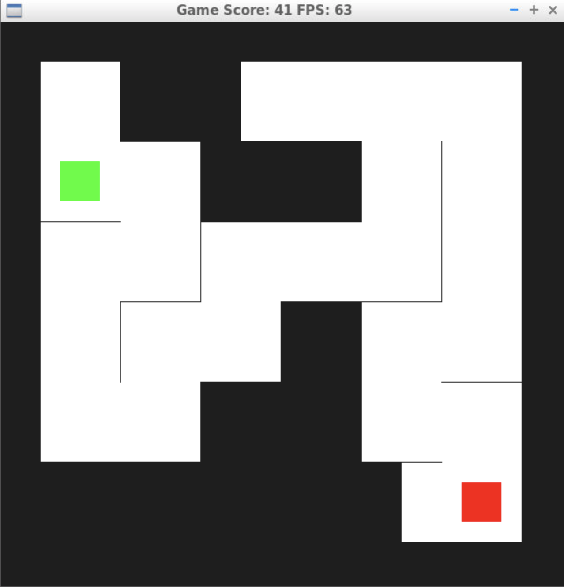

# CPPND: Capstone Maze Game 

This repo is the Capstone project in the [Udacity C++ Nanodegree Program](https://www.udacity.com/course/c-plus-plus-nanodegree--nd213). The code for this repo was built upon and inspired by [this](https://codereview.stackexchange.com/questions/212296/snake-game-in-c-with-sdl) excellent StackOverflow post and set of responses.

## Overview and Instructions 
The Capstone Project implements a maze-solving game, where the user guides a 'robot' through a maze. The goal of the game is to solve the maze in the minimum number of turns by controlling and moving a robot through the maze. The player's position, the robot,  is denoted by the green square. The goal/end point is in the lower right corner, and is represented by a red square. The maze path is hidden until the player/bot approaches each cell, and are revealed when the robot is in an adjacent cell.

The robot can be moved using the keyboard arrow keys.

If the player does not move for 2 seconds, the game moves into Automatic mode, where a search algorithim is applied to determine the 'optimal' move for the robot. Further details of the move optimization logic is below.

## Implementation
### Maze Construction
The Maze is constructed using an underlying graph representation, where each graph node represents each open cell, while edges denote adjacent cells. Each edge is allowed to be Open or Closed, representing the existance or absence of a wall which prevents movement between nods. 

The Edge object was designed to be bi-drectional, whilst maintaining a single (common) state. For example, if node A and node B are adjacent, node A maintains a list (std::vector) of edges departing itself. Node B maintains a similar list. These edges are directed; such that for edges connecting from node A to node B will have node A as parent, and node B as child. The complementary edge from B to A will accordingly have Node B as parent and Node A as child. This structure simplifies traversal of the graph using parent-child relationships.

The maze itself is constructed following the algorithm described in [Wikipedia](https://en.wikipedia.org/wiki/Maze_generation_algorithm), which is implemented as a stand alone MazeBuilder class. The Maze Builder consumes a Maze object and sets the Open/Closed status of the edges in the maze, by visiting and 'expanding' each node. When a new node is expanded, any unvisited adjacent nodes are added to the back of a 'frontier' list in a randomized order. If there are no unvisited neighbours for the node, then nothing is added to the list. The back (most recent) node on the frontier is then selected for subsequent expansion. Nodes may be added to the Frontier by multiple nodes; a check is performed to ensure redundant expansions are not performed.

As such, the algorithm implements a depth-first expansion that guarantees all nodes are expanded without cycles/loops.

### Auto-solve Mode
If the player does not make a move for 2 seconds, the robot is moved into automatic-solve mode. In this mode, the robot choose its own moves by selecting a 'boundary' cell to investigate. Boundary cells are cells that are connected to a visible cell, but are not yet visible (e.g. have not been explored yet). Note, visiting/expanding the 'Boundary' cells is the only option to expand the maze (all other cells have either been visited already, or require transiting through a Boundary cell.

The maze logic is capable of :
a) identifiying the boundary cells, and
b) generating a path between any two visible cells. 

The identification function is a simple search over all nodes. 

The path generation is implemented using a graph search algorithm on the maze. The maze structure ensures the maze can be represented by an acylic-graph (no loops). The underlying maze data structure is an undirected graph. The graph search starts at the robot's location, and recursively expandes the sub-graph along each edge. The recursion terminates is either a dead-end is reached or if the goal node is found. In the case the goal is discovered, the path to the node (found via the recursive steps) is returned and the first node expanded. 

### Optimization
Multiple Bounday cells may exist due to branches in the Maze. A heuristic function is used to determine the 'optimal' boundary cell for expansion by minimizing a cost function. The cost includes:
1. The cost to navigate the robot along an identified maze path to the boundary cell.
2. The Manhattan distance from the boundary cell to the goal (since the real path is not-yet visible).

Once the boundary cell with the lowest cost is identified, the robot moves along the first step of the path. Replanning / path generation is performed after every move. If the goal becomes revealed, the path planner optmizes for the shortest path to the goal.

## TODO
List of additional options to improve project;
- Implement thread-safe maze and bot objects.
- Add multiple bots to maze.
- Randomization of the goal location (along with multiple bots).
- Multi-thread bot in Auto mode, including path search algorithm, for use with large (eg 30x30) mazes.

## Dependencies for Running Locally
* cmake >= 3.7
  * All OSes: [click here for installation instructions](https://cmake.org/install/)
* make >= 4.1 (Linux, Mac), 3.81 (Windows)
  * Linux: make is installed by default on most Linux distros
  * Mac: [install Xcode command line tools to get make](https://developer.apple.com/xcode/features/)
  * Windows: [Click here for installation instructions](http://gnuwin32.sourceforge.net/packages/make.htm)
* SDL2 >= 2.0
  * All installation instructions can be found [here](https://wiki.libsdl.org/Installation)
  * Note that for Linux, an `apt` or `apt-get` installation is preferred to building from source.
* gcc/g++ >= 5.4
  * Linux: gcc / g++ is installed by default on most Linux distros
  * Mac: same deal as make - [install Xcode command line tools](https://developer.apple.com/xcode/features/)
  * Windows: recommend using [MinGW](http://www.mingw.org/)

## Basic Build Instructions

1. Clone this repo.
2. Make a build directory in the top level directory: `mkdir build && cd build`
3. Compile: `cmake .. && make`
4. Run it: `./Maze`.

